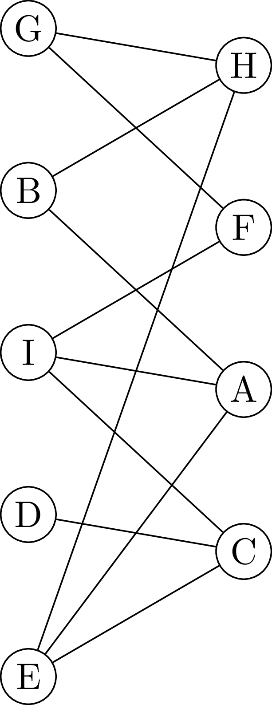
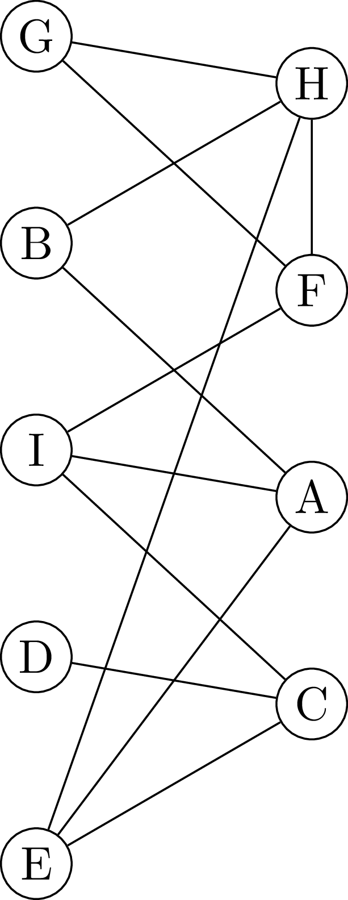

# Διμερείς Γράφοι

Ένας γράφος ονομάζεται διμερής (bibartite graph) αν μπορούν οι κορυφές του να χωριστούν σε δύο σύνολα, ώστε όλες οι ακμές του γράφου να ξεκινούν από το ένα σύνολο και να καταλήγουν στο άλλο.

Για παράδειγμα, ο παρακάτω γράφος είναι διμερής:



αφού οι κορυφές του μπορούν να χωριστούν σε δύο σύνολα, SetA = {G, B, I, D, E} και SetB = {H, F, A, C} όπου δεν υπάρχει καμμία ακμή μεταξύ των κόμβων που ανήκουν στο ίδιο σύνολο, ενώ όλες οι ακμές έχουν έναν κόμβο στο SetA και έναν κόμβο στο SetB.

Αντίθετα, αυτός ο γράφος δεν είναι:



αφού δεν μπορεί να γίνει διαχωρισμός σε δύο σύνολα όπως παραπάνω (λόγω της ακμής H - F).

Οι διμερείς γράφοι έχουν πολλές εφαρμογές, αρκεί να φανταστείτε ότι το ένα σύνολο αντιστοιχεί σε οντότητες ενός τύπου και το άλλο σύνολο αντιστοιχεί σε οντότητες ενός άλλου τύπου. Για παράδειγμα, το ένα σύνολο μπορεί να είναι άνθρωποι και το δεύτερο σύνολο εργασίες, ενώ οι σύνδεσμοι του γράφου δείχνουν το ποιοι άνθρωποι μπορούν να κάνουν ποιες εργασίες. 

Δεν είναι πάντα εύκολο να συμπεράνουμε με το μάτι αν ένας γράφος είναι διμερής. Κατ' αρχήν αυτό δεν είναι εφικτό αν ο γράφος είναι μεγάλος. Επιπλέον, ακόμα και για μικρούς γράφους, αναλόγως πώς τον απεικονίζουμε, μπορεί να μην μπορούμε να συμπεράνουμε εύκολα ότι ο γράφος είναι διμερής. Ο γράφος:


είναι ακριβώς ο ίδιος με τον πρώτο γράφο (μπορείτε να ελέγξετε μία-μία τις κορυφές και τις ακμές) αλλά δεν μπορούμε να αποφανθούμε βλέποντάς τον αν είναι διμερής.

Το πρόβλημα που πρέπει να λύσετε είναι να υλοποιήσετε έναν αλγόριθμο ο οποίος, αν του δώσετε ένα γράφο, να μπορεί να αποφανθεί αν ο γράφος αυτός είναι διμερής, και αν είναι να δίνει τα δύο σύνολα στα οποία χωρίζονται οι κορυφές του γράφου.

Για να βρείτε αν ένας γράφος είναι διμερής, μπορείτε να τον διατρέξετε χρωματίζοντας τις κορυφές του εναλλάξ με δύο διαφορετικά χρώματα. Ένας γράφος είναι διμερής αν και μόνο αν μπορεί να χρωματίσετε τις κορυφές του έτσι ώστε δύο γειτονικοί κόμβοι να μην έχουν το ίδιο χρώμα. Αν κατά τη διάσχιση του γράφου βρείτε ότι δύο γειτονικοί κόμβοι έχουν το ίδιο χρώμα, αμέσως ξέρετε ότι ο γράφος δεν είναι διμερής.

## Απαιτήσεις Προγράμματος

Κάθε φοιτητής θα εργαστεί στο προσωπικό του αποθετήριο στο GitHub. Για να αξιολογηθεί μια εργασία θα πρέπει να πληροί τις παρακάτω προϋποθέσεις:

1. Όλη η εργασία θα πρέπει να βρίσκεται σε έναν κατάλογο
  ``assignment-5`` μέσα στο αποθετήριο του φοιτητή.

2. Ο πηγαίος κώδικας του προγράμματος που θα γραφτεί θα πρέπει να βρίσκεται
  σε έναν υποκατάλογο ``src`` του καταλόγου ``assignment-5``.

3. Ο μεταγλωττισμένος κώδικας του προγράμματος που θα γραφτεί θα
  πρέπει να βρίσκεται σε έναν υποκατάλογο ``bin`` του καταλόγου
  ``assignment-5``. Έτσι, αν το αποθετήριο του φοιτητή είναι το
  ``example-repo``, η δομή των καταλόγων θα είναι:
    ```
    example-repo
        assignment-5
            src
            bin
    ```
4. Το πρόγραμμα θα πρέπει να έχει όνομα ``BipartiteChecker``.

5. Το πρόγραμμα θα πρέπει να εκτελείται με τον παρακάτω τρόπο:
```
java BibartiteChecker example.txt
```
ή 

```
java BibartiteChecker -b example.txt
```
ή 

```
java BibartiteChecker -d example.txt
```
Αν δίνεται το `-d` στην εντολή εκτέλεσης του προγράμματος, η διάσχιση του γράφου θα πρέπει να γίνεται κατά βάθος. Αν δίνεται το `-b`, η διάσχιση του γράφου θα πρέπει να γίνεται κατά πλάτος. Αν δεν δίνεται τίποτε από τα δύο, η διάσχιση του γράφου θα πρέπει να γίνεται κατά βάθος.

Το `example.txt` είναι ένα αρχείο κειμένου το οποίο περιγράφει τον γράφο με την εξής μορφή:
```
x1 x2
x1 x3
...
```
όπου κάθε γραμμή `x y` σημαίνει ότι ο κόμβος `x` συνδέεται με τον κόμβο `y`.
:
```
x1 >= x2 + t1
x1 >= x3 + t2
...
```
Τα `t1`, `t2`, κ.λπ. μπορεί να είναι θετικοί ή αρνητικοί αριθμοί. ***Οι διαδικασίες θα μπορούν να έχουν οποιοδήποτε όνομα***, και όχι απαραίτητα `x1, x2, ...`. 

Στην περίπτωση που υπάρχει λύση στο πρόβλημα, η έξοδος του προγράμματος θα είναι της μορφής:
```
x1: 4
x2: 2
x3: 4
x4: 0
x5: 1
```

***Οι διαδικασίες θα πρέπει να εμφανίζονται στην έξοδο του προγράμματος ταξινομημένες αλφαβητικά***, ακόμα και αν δεν δίνονται έτσι στο αρχείο εισόδου.

Στην περίπτωση που δεν υπάρχει λύση στο πρόβλημα, η έξοδος του προγράμματος θα είναι η:
```
No solution exists
```
Για να ελέγξετε το πρόγραμμά σας μπορείτε να χρησιμοποιήσετε τα αρχεία:

* [example_1.txt](example_1.txt)

* [example_2.txt](example_2.txt)

Αν μια εργασία δεν ικανοποιεί τις παραπάνω απαιτήσεις ***δεν θα είναι δυνατή η αξιολόγησή της***. Επιβεβαιώστε λοιπόν ότι πράγματι το πρόγραμμά σας μπορεί να κληθεί ***ακριβώς*** με τις εντολές που δίνονται παραπάνω, και ότι παράγει ***ακριβώς*** την έξοδο που περιγράφεται.

## Προσοχή

Για την εκπόνηση της εργασίας χρησιμοποιήστε τις τρέχουσες, ενημερωμένες σημειώσεις του μαθήματος όπως αυτές βρίσκονται στο σχετικό ιστότοπο.
